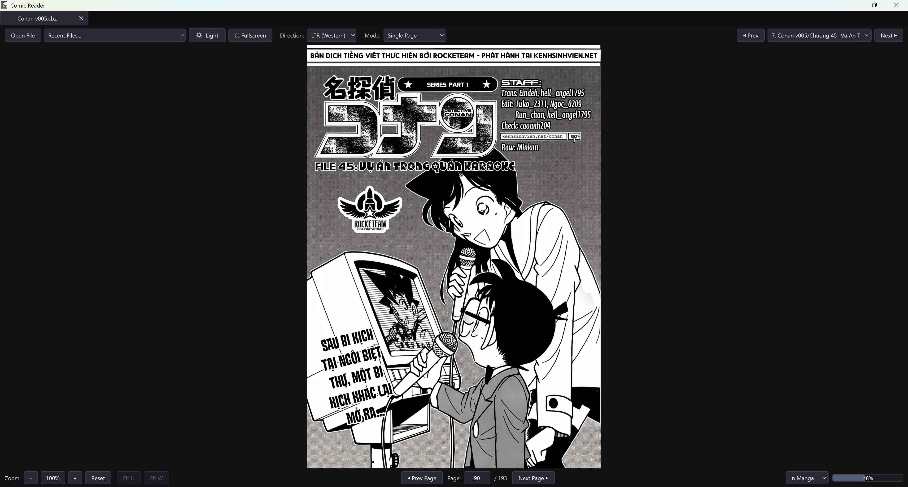
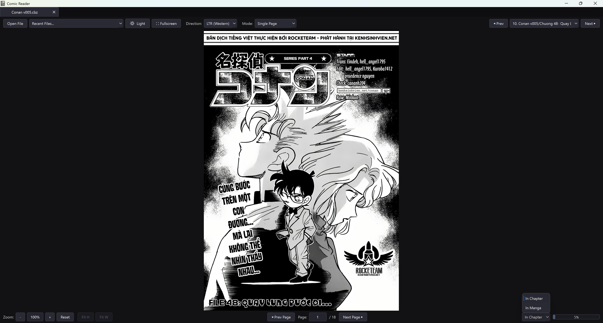

# Comic Reader

A lightweight, distraction-free comic and manga reader built for Windows desktop using Python and PyQt6.

> **Disclaimer & Note:** This is an ongoing personal hobby project primarily hosted here for my own storage, backup, and personal use. It runs reliably on my own PC, but has not yet been tested across different systems, hardware configurations, or Windows setups. Your mileage may vary. The codebase is still a bit messy and works-in-progress are active; continuous reading mode can be laggy on high-resolution archives, and performance optimizations will be added over time.

## Screenshots

### Chapter Selection Dropdown (Fullscreen)


### Reading Progress Bar (Fullscreen)


## Features

* **Broad Format Support:** Native viewing for `.cbz`, `.cbr`, `.pdf`, and `.epub`.

* **Automatic Chapter Detection:** If a `.cbz` or `.cbr` archive contains subfolders, ComicReader organizes them into distinct chapters selectable from the top dropdown menu.

* **Progress Tracking:** Interactive progress bar that tracks your reading progress scoped either to the current chapter or calculated continuously across the entire manga/archive.

* **Multiple Reading Modes:**

  * Single Page

  * Double Page (with or without cover offset)

  * Continuous Vertical Scroll

* **Direction Toggle:** Quick switch between Left-to-Right (Western comics) and Right-to-Left (Manga).

* **Tabbed Interface:** Read multiple documents simultaneously with multi-tab session restore on app restart.

* **Dark / Light Themes:** Toggleable UI styles tuned for reading comfort.

* **Single-Instance Navigation:** Opening new comic files in Windows opens a new tab in your existing window rather than spawning duplicate instances.

## Prerequisites

* **Python 3.10+** (if running from source)

* **CBR Support:** `.cbr` files require either `7z.exe` or `UnRAR.exe` to be installed on your system (e.g., standard 7-Zip or WinRAR installations), or placed alongside the app executable.

## Installation & Setup

### 1. Clone the Repository

```bash
git clone https://github.com/trietduong/comic-reader.git
cd comic-reader
```

### 2. Install Dependencies

```bash
pip install -r requirements.txt
```

### 3. Run from Source

```bash
python comic_reader.py
```

## Building the Executable

You can compile a standalone distribution folder using the included build script:

```bash
python build.py
```

The output will be generated inside `dist/ComicReader/`.

## Keyboard Shortcuts

| Shortcut | Action | 
| ----- | ----- | 
| `Right` / `Left` or `D` / `A` | Next / Previous Page (adapts to LTR/RTL) | 
| `F11` or `F` | Toggle Fullscreen | 
| `Esc` | Exit Fullscreen | 
| `Ctrl` + `+` / `Ctrl` + `-` | Zoom In / Out | 
| `Ctrl` + `0` | Reset Zoom | 
| `Ctrl` + `W` | Close Current Tab | 
| `Ctrl` + `Tab` / `Ctrl` + `Shift` + `Tab` | Next / Previous Tab | 

## Known Issues & Roadmap

* [ ] **Continuous Mode Latency:** Scrolling can feel sluggish with large archives containing uncompressed high-resolution images.

* [ ] **Cross-Device Testing:** Verify installation, path behavior, and rendering across different Windows versions and screen scaling settings.

* [ ] **Code Refactoring:** Split monolithic viewer and controller components into modular packages.

* [ ] Memory footprint optimizations during deep archive page scans.

## Credits & Attributions

* Application icon and file format icons (`.cbz`, `.cbr`, `.pdf`, `.epub`) created by **Magnific** from **Flaticon**.

* Powered by [PyQt6](https://www.riverbankcomputing.com/software/pyqt/) and [PyMuPDF](https://github.com/pymupdf/PyMuPDF).